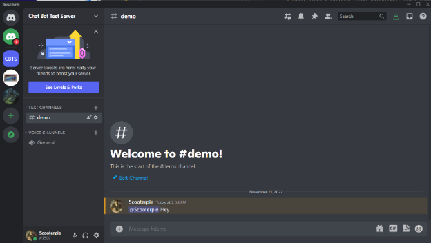
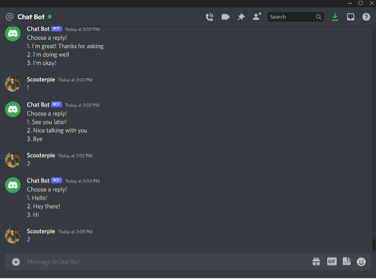
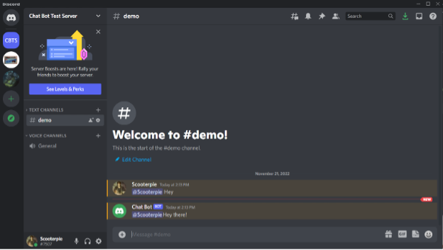
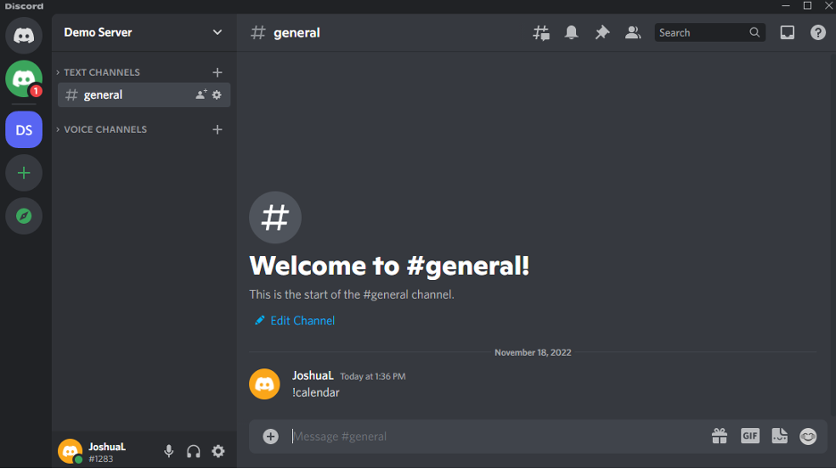
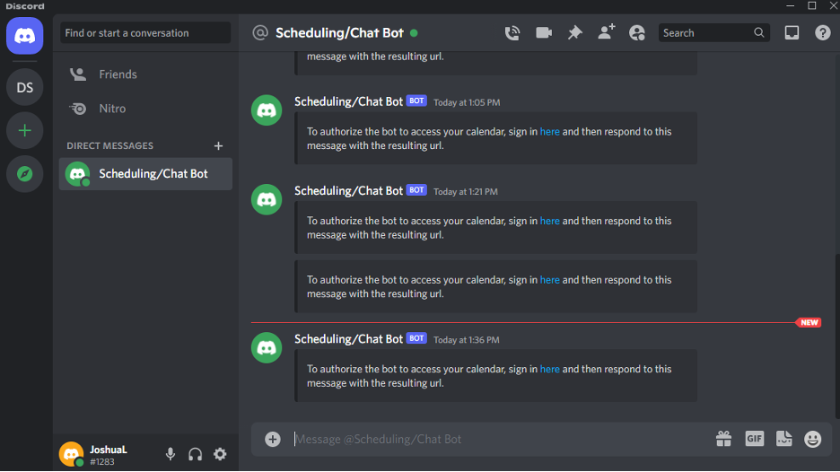
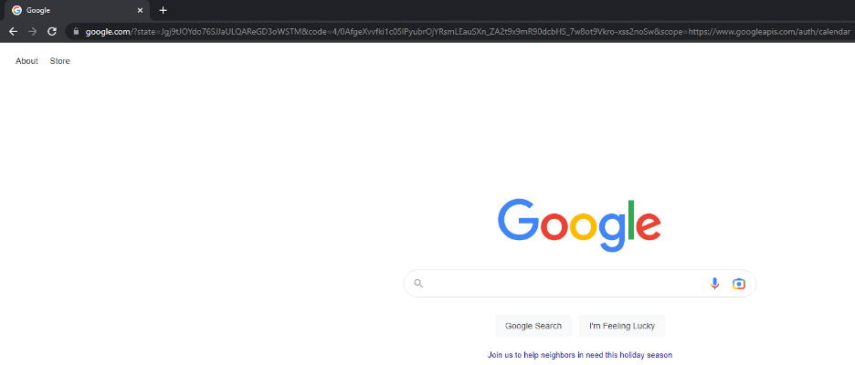
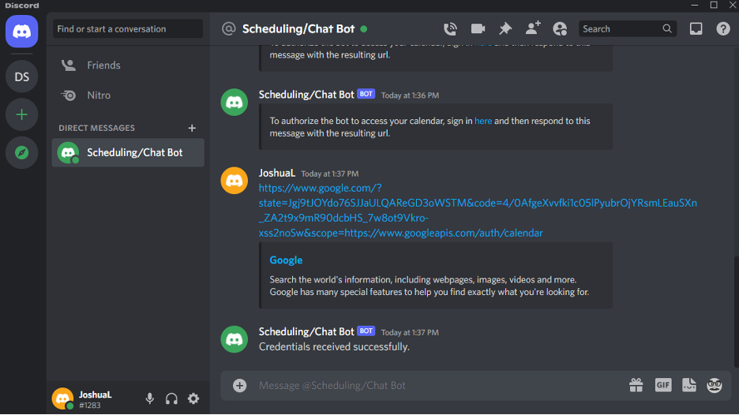
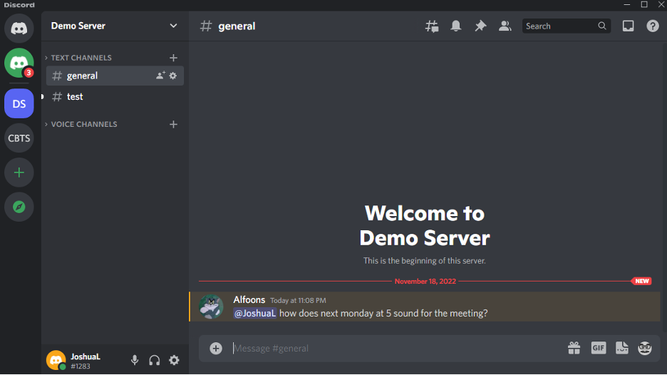
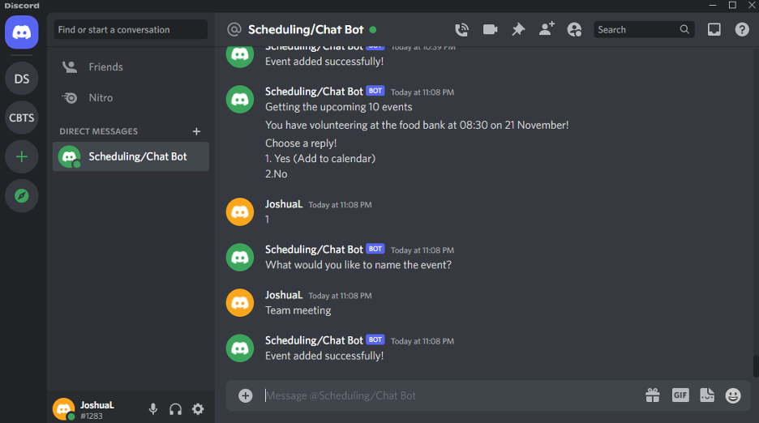
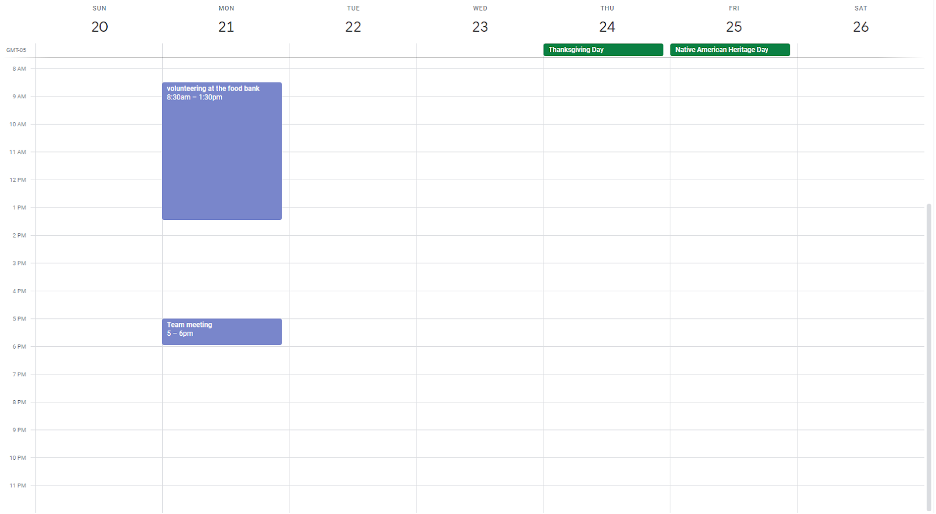

# Discord Chat and Scheduling Bot
## Team Members: Stirling Sites, Joseph Racz, and Joshua Lopez
**Project Description**: Our team created a Discord bot that will generate response options for a user when the user is pinged. We have integrated the bot with the Google Calendar API to help users schedule calendar events with one another.

**Technology Used:** Python PEP 8 and Google Calander API

**Next Steps to Improve the Discord Bot:** Add machine learning, add additional bot responses, and integrate the bot with other calendar APIs

## Setup

This project contains multiple components that must be set up prior to use:
- A Discord bot must be [created](https://discord.com/developers/docs/getting-started) and given adminstrator privileges. 
  - The bot's token should be stored in a variable called DISCORD_TOKEN in a file named ".env" within the working directory.
- A project within Google Cloud must be [created](https://cloud.google.com/resource-manager/docs/creating-managing-projects). 
  - The Google Calendar API has to be [enabled](https://cloud.google.com/apis/docs/getting-started#enabling_apis).
  - OAuth2 credentials have to be [set up](https://support.google.com/cloud/answer/6158849) for a web application with "https://google.com" as an authorized redirect URI.
  - The credentials have to be downloaded and stored in a file named "credentials.json" within the working directory.
  - (Optional) The publishing status has to be [changed](https://support.google.com/cloud/answer/10311615) to "in production" to allow anyone to use the calendar functionality.

With these criteria met, the project is ready to run.

## Using the Chat Bot

**Step 1:** When the user is mentioned the bot will send them a DM

**Step 2:** The bot gives the user different options to respond with in DMs

**Step 3:** The user then picks an option and that response is sent in the chat

## Using the Calendar

**Step 1:** Users can begin giving their credentials with !calendar

**Step 2:** The bot sends a DM with a link to sign into Google

**Step 3:** After signing in, users are redirected to a Google page containing their authorization code in the url

**Step 4:** Users send the bot the url through DMs and receive a confirmation message

**Step 5:** Users can mention others with a specified time to initiate event adding

**Step 6:** The bot shows mentioned users their scheduled events through DMs and users can set up a new event in their calendar

**Step 7:** The event now appears in the user’s Google Calendar

